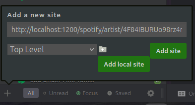
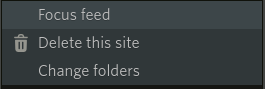
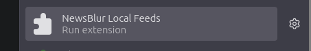
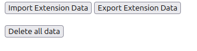

# Newsblur Local Feeds

If you have RSS feeds that are hosted on your computer, e.g. using RSS Hub, then Newsblur cannot access them. You could set up a static IP address and port-forward, or you could move the RSS feed to a cloud service. Alternatively, this extension can fetch the local feeds using internal IP addresses, and view them in Newsblur.

Features
- Adding local feeds.
- Deleting local feeds.
- Focussing local feeds.
- Moving local feeds to different folders.
- Importing and exporting all data in this extension.
- Keyboard shortcuts j, k, m, and u, for navigating between stories and marking them as read.

Limitations
- Only the split view is supported for viewing local feeds. 
- All data is stored locally, so it won't sync up between browser instances.

#  Installation (Developer)

1. Clone this repository.
2. Make sure node package manager is installed.
3. Run `npm install` in this repository.
4. Run `npm run build`.
5. Go to the url "about:debugging" in firefox, click "load temporary addon", and click on the manifest.json file in this repository.

# Usage

You can add local feeds the same way as you add normal feeds.
1. Click the "+" button in Newsblur.
2. Enter the address of your local feed (e.g. "localhost").
3. Select a folder.
4. Click "Add local site". The local feed will then appear in Newsblur like any other feed.

You can right click the local feed to open a context menu, which allows you to move it, delete it, or focus it.

To import or export all data, click the browser icon for this extension to open the extension page. This page also allows you to clear all data.

